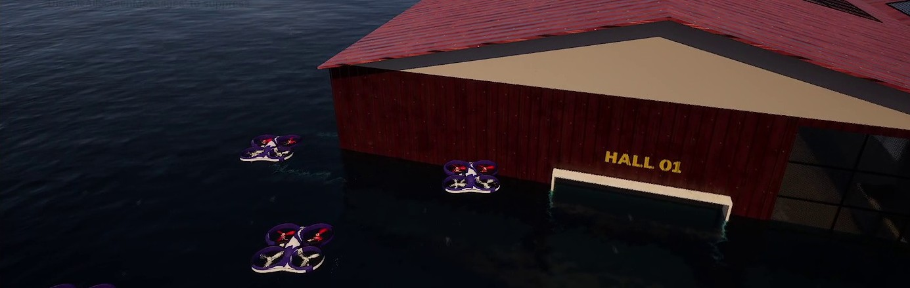

# VeriSwarm · Flood Rescue Drone Simulation

Pratik Raj's engineering contribution showcase for the SIH 26177 disaster search-and-rescue project.

**Five drones. A flooded industrial city. A monitored journey from launch point to rooftop.**



*Actual simulator recording frame, cropped to remove editor chrome and local-path overlays. Visual illustration only; not independent acceptance evidence.*

This portfolio documents my simulator/environment and movement work within [the team VeriSwarm project](https://github.com/berlinflix/VeriSwarm_SIH). It is not a claim of sole authorship of VeriSwarm or a production-ready rescue system.

## What I built

- **FactoryCity_Disaster:** a separate Unreal Engine flood scenario, rising floodwater, visibility/rainfall tuning, and preservation of road/building collision geometry.
- **Five-drone setup:** repeatable separated spawns at Point_A, coordinate-frame audits, and flood-relative altitude control.
- **Nominal A → B mission:** formation travel, separation/collision monitoring, rooftop approach, and controlled descent with verified roof contact before disarming.
- **Movement-v2 integration:** a separate sensor-driven runner using cell ownership, durable movement events, and gated command dispatch; integrated Abhijan's authorization lease handoff.
- **Sensor handoffs:** RGB/depth/pose capture tooling and reproducible simulator setup for teammates.
- **Reliability fixes:** telemetry timestamps after RPC reads, cross-machine clock-skew bridging, and failure hover that retains API control instead of disarming airborne drones.

## Documented nominal milestone

The committed team status records the following historical live nominal-v1 PASS:

| Measurement | Recorded result |
| --- | ---: |
| Fleet | 5 drones |
| A → B route | 95.0474 m |
| En-route samples | 96 |
| Maximum arrival error | 0.8262 m |
| Maximum cross-track error | 0.0066 m |
| Minimum observed separation | 2.7421 m |
| Final rooftop separation | 2.8284 m |
| Final state | All five landed; zero vertical speed; audited roof collider |

[Read the committed milestone](https://github.com/berlinflix/VeriSwarm_SIH/blob/883df7e/codebase/docs/team_updates/STATUS_PRATIK.md). This is a historical reported result, not a new qualification run. Later development runs also failed; see [evidence boundaries](docs/EVIDENCE.md).

## Explore the engineering

- [Contribution timeline and original commits](docs/CONTRIBUTIONS.md)
- [Architecture and design decisions](docs/ARCHITECTURE.md)
- [Evidence, limitations, and review scope](docs/EVIDENCE.md)
- [Upstream simulator runbook](docs/RUNBOOK.md)
- [Resume / LinkedIn project description](docs/PROFILE.md)

## Run the lightweight example

```sh
python examples/flood_mission.py
python -m unittest discover -s tests -v
```

Python 3.10+; no third-party dependencies. The example demonstrates coordinate conversion, formation separation, flood clearance, and fail-closed leases. **It is a deterministic educational example, not CoSim flight software, a security verifier, or evidence of real-world autonomy.**

## Team attribution

My lane: simulator world, sensor tooling, nominal movement and movement-v2 integration. Drone movement was jointly coordinated with Abhijan. Abhijan owns the security/authorization work and dashboard integration; Samik owns perception/model inference; Suyash coordinates architecture/integration. The original repository retains the complete team history and source ownership.

Unreal projects, third-party map assets, models, datasets, raw captures, private conversations, and credentials are intentionally excluded. No upstream code has been relicensed here.
