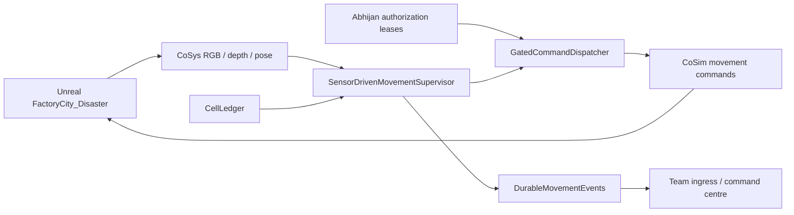

# Architecture and engineering decisions

The diagram describes the movement-v2 integration design; it does not assert that every acceptance scenario passed live.

## Coordinate discipline

Unreal uses centimetres with Z upward. AirSim/CoSys movement uses metres in a North-East-Down frame relative to an origin. A world Z value alone is not height above local terrain. Convert positions relative to the actual origin; audit the ground/roof collider separately.

In NED, rising water makes water Z more negative. A safe cruise target is `min(cruise_z, water_z - clearance)`, not `max(...)`. Clearance must also account for drone geometry, waves, obstacles and controller tracking error. The portable example only models the centre point over a flat water surface.

## Keep the known-good path

Nominal-v1 remained separate while movement-v2 added sensor decisions and authorization. This preserved a reproducible fallback without silently presenting nominal waypoint flight as SLAM or obstacle avoidance.

## Fail closed without falling

Expired/missing leases prevent mission dispatch. Once airborne, loss of authorization should trigger the designed safe hold path, not disarm in the air. Retaining API control during failure hover was an explicit reliability fix. Emergency hover is a safety path, not proof that a rejected mission command was authorized.

## Observation time matters

Slow CoSim RPC calls can make a timestamp captured before a read stale before enqueue. The fix timestamps telemetry after reading rather than widening the frozen event deadline. A restricted receiver bridges bounded Mac/Windows skew before strict lease checks; this is not permission to accept arbitrary future or stale claims.

## Terrain is not water

Visual flood meshes do not replace road/ground colliders. Rooftop touchdown requires physical contact and stable state verification, not simply reaching a requested Z. Flood appearance, drone motion and security decisions are independently testable concerns.
